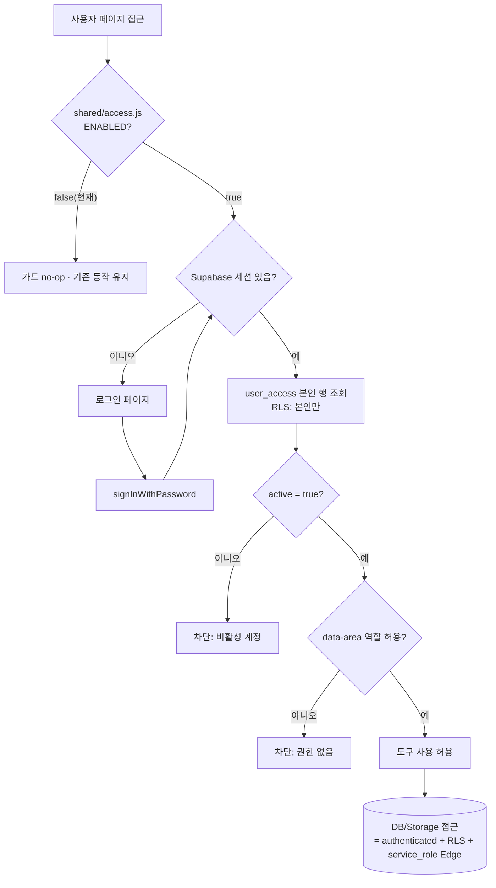

# AUTH_AND_RLS_DESIGN

> 저장소: merittour-tools · 브랜치: `claude/security-hardening` · 기준 커밋: `e6b61fc` · 작성일: 2026-07-21
> 문서 상태: 기술기준 · 운영 DB 미실행(준비만) · 비밀값 미포함

---

## 1. 현재 인증 구조
- 프론트 접근제어 = 클라이언트 게이트(`shared/gate.js`, 비번 SHA-256 해시 + 이름, localStorage 30일). **서버 보안 아님**(소스·해시 공개, 우회 가능).
- Supabase = **anon 키 + RLS**. 현재 RLS 가 anon 전면 허용이라 사실상 무방비.
- `auth.js`(Google GSI) 휴면(`ENABLED:false`).

## 2. 문제점
- anon 키는 프론트에 노출(정상)되지만, **RLS 가 실제 보안 경계**여야 하는데 anon 전면허용이라 무력.
- 고객 개인정보(대표명·전화·PNR·확정서)가 anon 으로 접근 가능.
- confirm-docs 직접 업로드/공개 링크, 알림톡 함수 무인증, cron fail-open.

## 3. 목표 구조
- **Supabase Auth**(이메일+비번) + **관리자 초대**(자가가입 OFF).
- **user_access** 테이블(role/active)로 역할 관리: `admin / sales / air / manage`.
- 모든 DB/Storage 접근은 **authenticated + RLS(역할 기반)**. anon 제거.
- confirm-docs 업로드는 **Edge Function(service_role)** 단일 경로.
- 게이트(`gate.js`)는 UX용으로만 유지(또는 제거) — 실제 보안은 Auth+RLS.

## 4. 사용자 로그인 흐름

근거: `shared/access.js`, `supabase/migrations/01_user_access.sql`

## 5. 역할 및 권한 구조
| 역할 | 설명 | reservations | resort_master | history | confirm-docs 업로드 |
|---|---|---|---|---|---|
| `admin` | 관리자 | 조회·등록·수정 | 조회·수정 | 조회·추가 | 가능 |
| `sales` | 영업 | 조회·등록·수정 | 조회 | 조회 | 가능 |
| `manage` | 운영/마스터 | 조회·등록·수정 | 조회·수정 | 조회·추가 | 가능 |
| `air` | 항공 | 조회 | 조회 | 조회 | (기본) 불가 |
- 판정 함수: `mt_role()`, `mt_is_admin()`, `mt_has_role(text[])`, `mt_is_active()` (security definer, `search_path=public`, execute=authenticated). 근거: `01_user_access.sql`

## 6. 데이터별 접근권한(정책 요약)
| 대상 | select | insert/update | 기타 |
|---|---|---|---|
| reservations | admin·sales·air·manage | admin·sales·manage | delete 없음 · cron=service_role |
| resort_master | 전 역할 | admin·manage | delete 없음 |
| resort_master_history | 전 역할 | admin·manage(insert) | update·delete 금지 |
| user_access | 본인 or admin | admin | — |
| confirm-docs | Edge(service_role) | Edge(service_role) | 버킷 Private |
| notice_sent | (서버) | (서버) | anon·authenticated 차단 |

## 7. 마이그레이션 순서
1. `supabase/migrations/01_user_access.sql` (테이블·함수)
2. 최초 admin 계정 초대(Auth) + `user_access` 에 admin 1행(수동)
3. `02_reservations_rls.sql`
4. `03_resort_master_rls.sql`
5. `04_confirm_docs_storage_rls.sql` (⚠ 링크 영향 — 사전 공지)
6. Edge Function 배포: `upload-confirm-doc`, (수정)`cron-d7-alimtalk` · 시크릿 설정
7. 클라이언트: `shared/access.js` `ENABLED=true` + URL/ANON_KEY/LOGIN_URL 설정, 로그인 페이지 준비
8. `supabase/verify_security.sql` 로 검증

## 8. 운영 적용 전 확인사항
- confirm-docs 운영 버킷 public/private 여부(`확인 필요`)와 기존 링크 사용처.
- send-alimtalk 요청 인증 도입 여부(도입 시 대시보드 호출에 JWT 필요).
- 로그인 페이지 경로(`LOGIN_URL`)·이메일 초대 대상 명부.
- reservations 행 단위 담당 제한 필요 여부(담당/팀 컬럼 도입).

## 9. 롤백 방법(요약)
- 클라이언트: `access.js` `ENABLED=false` (즉시 가드 해제).
- SQL: `ROLLBACK_GUIDE.md` 의 역-마이그레이션(anon 정책 재생성) — 단, 보안 약화이므로 최후수단.
- Edge: 이전 버전 재배포.

## 10. gate.js / auth.js 정리 방침
- `gate.js`: 유지(UX 가림막) 또는 Auth 도입 후 제거 검토 — `확인 필요`.
- `auth.js`(Google GSI): 본 설계는 Supabase Auth 채택 → **중복 방지 위해 `auth.js` 폐기 권장**(또는 대체 로그인 옵션으로만 보존). 신규 구현은 `shared/access.js` 로 단일화.
